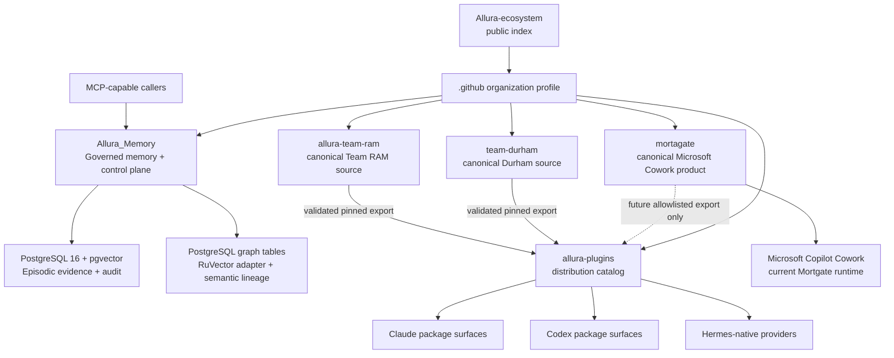

# Allura Ecosystem — Public Repository Topology and Index

This repository is the public source-of-truth index for how the Allura repositories relate. It maps authority, distribution, and runtime boundaries; it does not duplicate sibling product source or replace the owning repositories' implementation documentation.

Repository code, schema, machine-readable source/export contracts, and accepted decisions outrank this summary if they disagree.

## Repository model

Allura is a set of independent public repositories, not a monorepo and not a set of submodules.

| Repository | Canonical responsibility | Public baseline evidence |
|---|---|---|
| [`Allura_Memory`](https://github.com/Allura-Ecosystem/Allura_Memory) | Governed memory and control plane: MCP/API, PostgreSQL storage, PostgreSQL graph tables, RuVector adapter, curator, policy, and audit | Public canonical product repository; owning README and AD-49/AD-50 define the active architecture |
| [`allura-team-ram`](https://github.com/Allura-Ecosystem/allura-team-ram) | Canonical Team RAM multi-agent software-delivery harness source | [`c8df970f2a8900c6b9717de0012fd8706b6b250f`](https://github.com/Allura-Ecosystem/allura-team-ram/commit/c8df970f2a8900c6b9717de0012fd8706b6b250f), CI green |
| [`team-durham`](https://github.com/Allura-Ecosystem/team-durham) | Canonical Team Durham brand-production source: 12 canonical roles plus the `openagent` compatibility fallback | [`7e521976aef40b396e439d45c867d990c8237b11`](https://github.com/Allura-Ecosystem/team-durham/commit/7e521976aef40b396e439d45c867d990c8237b11), clean canonical root, CI green |
| [`mortagate`](https://github.com/Allura-Ecosystem/mortagate) | Canonical Mortgate Microsoft Copilot Cowork mortgage evidence-review product source | [`c926bdbe101829c7937ad90f9ee08100a55f463a`](https://github.com/Allura-Ecosystem/mortagate/commit/c926bdbe101829c7937ad90f9ee08100a55f463a), CI green |
| [`allura-plugins`](https://github.com/Allura-Ecosystem/allura-plugins) | Distribution catalog for runtime packages and generated exports; it does not replace standalone source authority | Public catalog; install aliases remain `team-ram-coding` and `team-durham` |
| [`.github`](https://github.com/Allura-Ecosystem/.github) | Organization profile and community metadata mapping the public surfaces | Public organization profile repository |
| [`Allura-ecosystem`](https://github.com/Allura-Ecosystem/Allura-ecosystem) | This public repository index, shared doctrine, topology, and navigation | Public index repository |

A sibling checkout is only a local convenience. The GitHub repository and its declared source contract remain authoritative.

## Topology and authority flow



The source direction is one-way:

```text
standalone canonical repository
        ↓ validate an explicit public/export allowlist
commit-pinned generated export
        ↓ publish or install
allura-plugins catalog/runtime surface
```

Fixes flow back to the standalone owner before regeneration. A generated catalog copy is pinned and non-authoritative; it must not become a second editable source.

## Allura Memory and Allura Brain

**Allura Memory** is the governed memory product and repository. **Allura Brain** is the governed MCP/API capability it provides, not a separate repository.

Allura Memory uses one PostgreSQL engine with two governed logical layers:

| Layer | Current store | Purpose | Mutation model |
|---|---|---|---|
| Episodic evidence | PostgreSQL 16 + pgvector | Events, traces, proposals, embeddings, and audit evidence | Append-oriented |
| Semantic knowledge | `graph_memories`, `graph_supersedes`, and related PostgreSQL graph tables through the `ruvector` adapter | Curated memories and relationships | Promote, supersede, deprecate |

The governed lifecycle remains evidence → proposal → accountable approval → canonical materialization → scoped retrieval with provenance. Agent-facing clients use MCP/API operations rather than direct database access.

### Neo4j sunset

Neo4j is not an active store, dependency, or fallback. AD-49 records the PostgreSQL graph-table cutover; AD-50 formalizes the PostgreSQL-only sunset. Historical plans, archived records, compatibility comments, and dated operational notes may preserve Neo4j references as migration history, but they do not define current rules or topology.

`GRAPH_BACKEND=ruvector` names the PostgreSQL-table graph adapter. It should not be described as proof that an optional native RuVector extension is active.

### Verified ports and paths

Only owning-repository instructions should be copied into operator guidance. The current [`Allura_Memory` README](https://github.com/Allura-Ecosystem/Allura_Memory#start-the-containerized-service) documents:

| Surface | Verified value |
|---|---|
| Compose MCP gateway | Host `6477` → container `3201`; readiness at `http://localhost:6477/ready`; MCP at `http://localhost:6477/mcp` |
| Direct development gateway | Defaults to port `3201` |
| PostgreSQL | Loopback-only `127.0.0.1:5432` in the documented Compose stack |

No historical `5888` or Neo4j health instruction is active guidance.

## Team and product sources

### Team RAM

[`allura-team-ram`](https://github.com/Allura-Ecosystem/allura-team-ram) is the canonical public source for the standalone Team RAM software-delivery harness. It supports OpenCode, Claude Code, and Codex runtime surfaces and remains useful without Allura Memory; optional Memory integration must degrade visibly when unavailable.

Its `SOURCE.json` and `PUBLIC_EXPORT.json` define ownership and public export scope. `allura-plugins` consumes a pinned generated export under the existing install alias **`team-ram-coding`**.

### Team Durham

[`team-durham`](https://github.com/Allura-Ecosystem/team-durham) is the canonical public source for Team Durham. Its role model is **12 canonical roles plus one non-persona `openagent` compatibility fallback**. The fallback explains why some manifests contain 13 agent-definition files without creating a thirteenth canonical role.

Team Durham's export tooling injects source-revision provenance and a file inventory. `allura-plugins` consumes the generated package under the existing install alias **`team-durham`**.

### Mortgate

[`mortagate`](https://github.com/Allura-Ecosystem/mortagate) is the canonical public source for **Mortgate Evidence Review for Microsoft Copilot Cowork**. Its current product lives in `microsoft-cowork/` and provides four human-supervised mortgage evidence-review Agent Skills. It does not approve or deny credit, set pricing, issue notices, contact borrowers, or write to a loan system of record.

Mortgate is a Microsoft 365/Copilot Cowork product surface, not a Claude or Codex package. Its `catalog-export.json` defines a possible future allowlisted export to `allura-plugins/packages/mortagate-cowork`; that path is not a current published package or install alias.

Salesforce/Veridact files under `force-app/` and their former gates are retained as historical evidence after ADR-36. They are not supported for current product development or deployment.

## Distribution catalog

[`allura-plugins`](https://github.com/Allura-Ecosystem/allura-plugins) owns catalog assembly, manifests, runtime packaging, model-policy metadata, and release validation. It does not own the canonical Team RAM, Team Durham, or Mortgate content copied into generated packages.

| Catalog/runtime surface | Authority boundary |
|---|---|
| `allura-cowork` | Catalog-owned Claude/Codex coordination package; coordinates distinct runtimes and does not imply that another runtime executed |
| `team-ram-coding` | Install alias for a pinned generated export from `allura-team-ram` |
| `team-durham` | Install alias for a pinned generated export from `team-durham` |
| `plugins/hermes-allura-brain` | Hermes-native provider maintained by the catalog |
| Future `packages/mortagate-cowork` | Reserved generated-consumer path from Mortgate; not currently published |

Current Claude marketplace aliases remain:

```text
/plugin marketplace add Allura-Ecosystem/allura-plugins
/plugin install allura-cowork@allura-ecosystem
/plugin install team-durham@allura-ecosystem
/plugin install team-ram-coding@allura-ecosystem
```

Claude, Codex, Hermes, OpenCode, and Microsoft Copilot Cowork are distinct runtime surfaces. A manifest, model alias, export, or prepared handoff is not proof that a runtime installed, loaded, or executed the package.

## Organization profile

The [`.github` organization profile](https://github.com/Allura-Ecosystem/.github/blob/main/profile/README.md) maps the public Allura Memory, Team RAM, plugin catalog, and ecosystem-index surfaces. This index expands that map with the now-canonical Team Durham and Mortgate repositories and their source/export boundaries.

## Historical and local-only material

This repository contains archives, journals, governance notes, client migration plans, and compatibility artifacts. Preserve them when they provide dated evidence, but do not use them as current architecture or deployment instructions.

In particular:

- `clients/faith-meats/MIGRATION-PLAN.md` is a dated plan, not live deployment evidence.
- `docs/archive/` is historical planning material.
- older references to Neo4j, port `5888`, a local monorepo layout, Salesforce Veridact as the active Mortgate product, or local Team RAM/Durham copies are superseded as active guidance.

## Source precedence

1. Owning repository implementation, schema, active configuration, `SOURCE.json`, and export contracts.
2. Accepted owning-repository decisions, including Allura Memory AD-49/AD-50 and Mortgate ADR-36.
3. Owning repository README and canonical architecture documentation.
4. This repository's `README.md`, `ECOSYSTEM.md`, `AGENTS.md`, and `CLAUDE.md`.
5. Generated exports, runtime-installed copies, archived plans, journals, and compatibility history.

## Remaining unknowns

This index does not claim current deployment health, production readiness, client authorization, customer outcomes, or native runtime installation unless the owning runtime provides dated evidence. Those operational facts must be verified at the target system rather than inferred from repository visibility or a green source-repository CI run.

---

*Repository-model baseline updated: 2026-09-01.*
