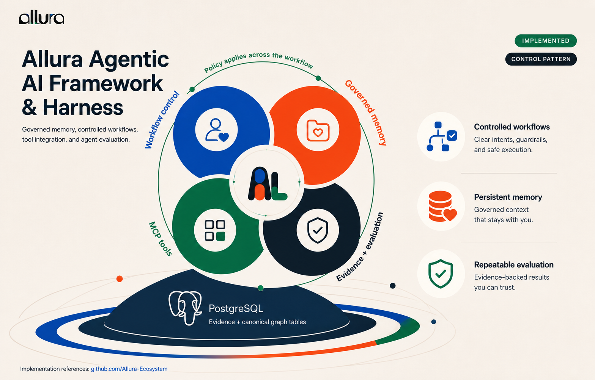
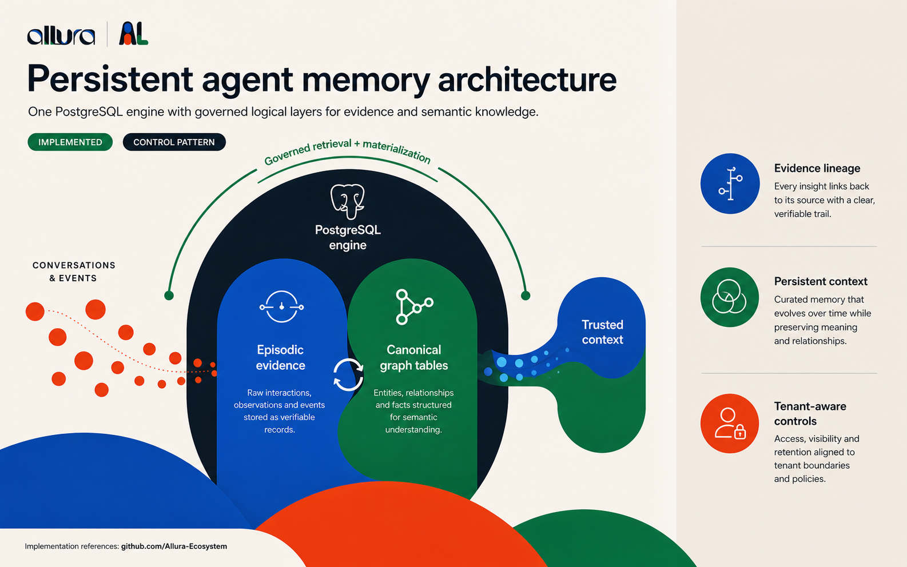
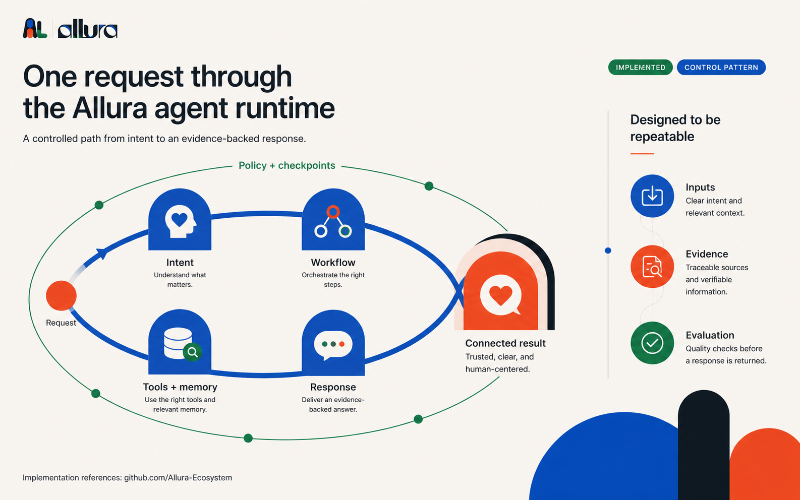
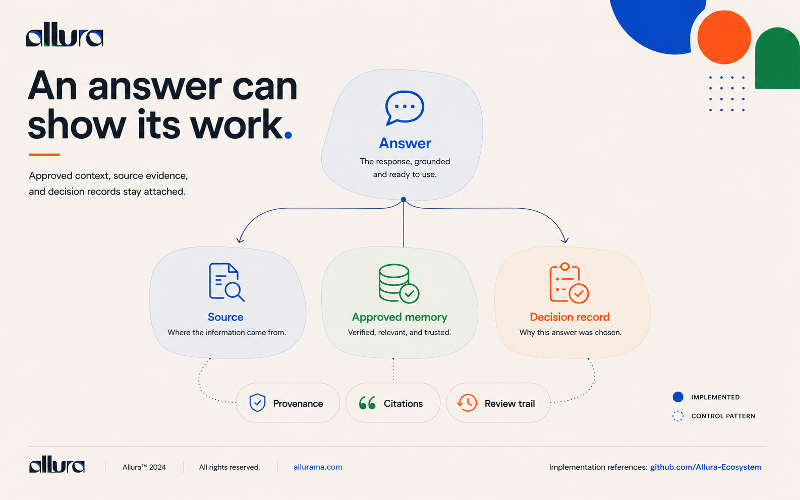
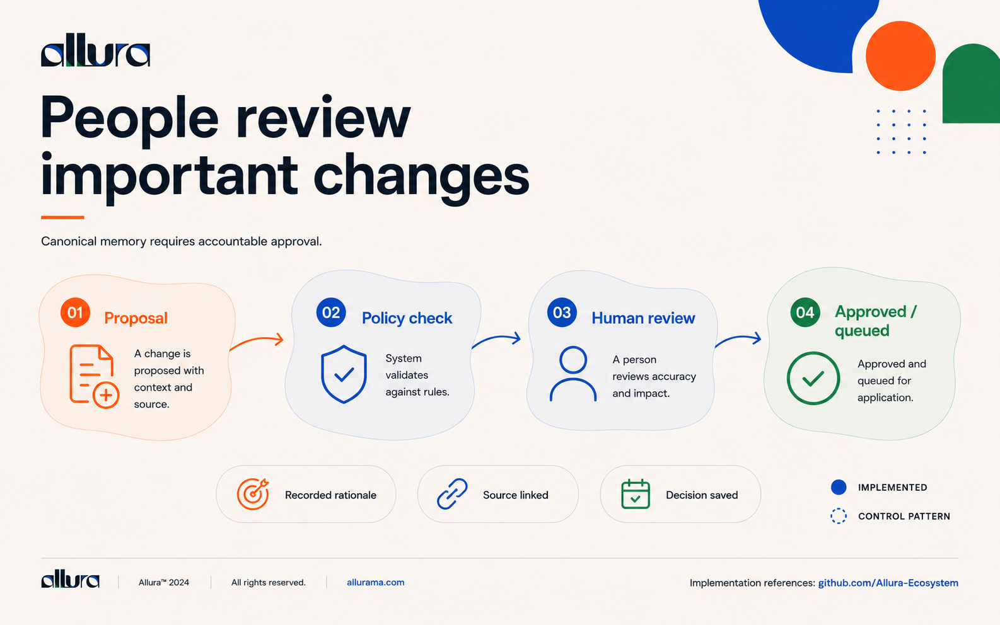
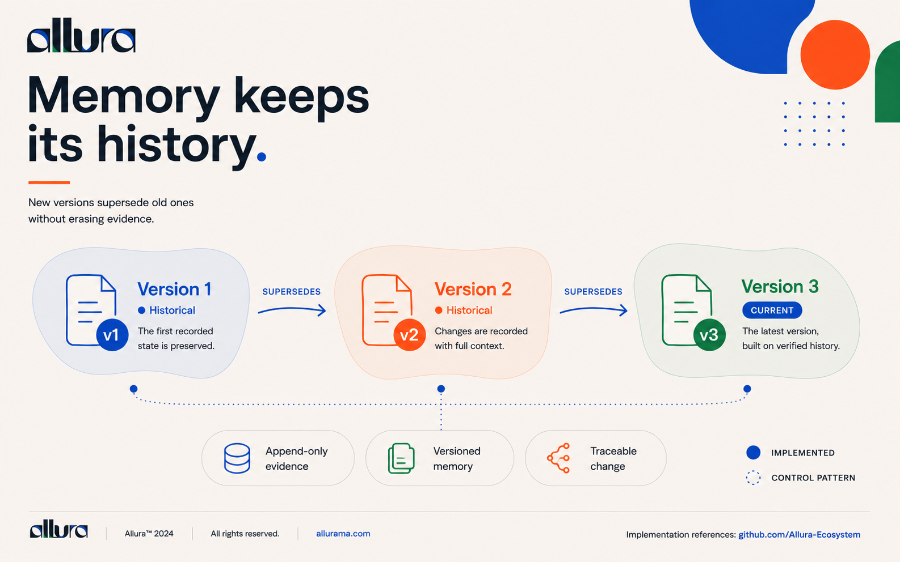
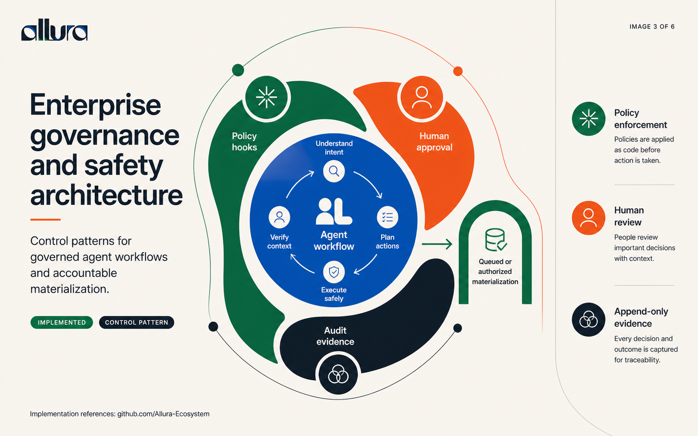

<p align="center">
  
</p>

<h1 align="center">Memory That Shows Its Work</h1>

<p align="center">
  <strong>A governed memory ecosystem for AI agents.</strong><br/>
  Capture activity, govern durable knowledge, and return scoped context with inspectable provenance.
</p>

---

## What Allura is

Allura is the ecosystem built around **one PostgreSQL engine holding governed memory** for AI agents. Its center is **Allura Memory**, a self-hosted, MCP-native memory and governance service. Around it are workflow plugins and runtime coordination protocols that follow the same evidence-first operating contract:

> **Logs are not knowledge. Knowledge is earned, versioned, scoped, and approved.**

### The three promises

| Promise | What it means |
|---|---|
| **Memory** | Agents retrieve useful context across sessions without treating every old trace as truth. |
| **Connection** | Claude, Codex, and specialist workflows coordinate through governed interfaces. |
| **Clarity** | Canonical memory retains tenant scope, lifecycle state, provenance, and version lineage. |

---

## How it works

### 1. One system, five pillars

<p align="center">
  <a href="docs/images/framework-and-harness.png"></a>
</p>

Allura is built around one PostgreSQL engine holding **governed memory** (evidence + semantic knowledge), **controlled workflows** (clear intent, guardrails, safe execution), **MCP tools** (integration with Claude, Codex, specialist runtimes), **evidence + evaluation** (traceable sources and repeatability), and **persistent context** (curated memory that evolves while preserving relationships).

---

### 2. The core: one database, two logical layers

<p align="center">
  <a href="docs/images/persistent-agent-memory.png"></a>
</p>

Inside one PostgreSQL engine live two distinct layers: **episodic evidence** (raw interactions, observations, and events stored as verifiable records) and **canonical graph tables** (entities, relationships, and facts structured for semantic understanding). Conversations and events flow in → trusted context flows out, with governed access and tenant-aware controls.

---

### 3. Every request follows a controlled path

<p align="center">
  <a href="docs/images/agent-runtime-request-flow.png"></a>
</p>

Understand **intent** → orchestrate **workflow** → use **tools and memory** → deliver evidence-backed **response** → return **connected result**. All governed by policy checkpoints and designed to be repeatable. Quality checks happen at every step.

---

### 4. Answers ground in evidence

<p align="center">
  <a href="docs/images/an-answer-can-show-its-work.png"></a>
</p>

Every Allura result carries **provenance** (who recorded it), **citations** (where the information came from), and a **review trail** (why this answer was chosen). Transparency builds trust.

---

### 5. Humans approve before truth is written

<p align="center">
  <a href="docs/images/people-review-important-changes.png"></a>
</p>

Before something becomes canonical truth in Allura's memory, a human reviews it. **Proposal** → **policy check** → **human review** → **approved and queued**. This HITL gate ensures durable knowledge is not written autonomously.

---

### 6. Everything stays traceable forever

<p align="center">
  <a href="docs/images/memory-keeps-its-history.png"></a>
</p>

Memory doesn't rewrite itself. New versions **supersede** old ones — the old stays visible and traceable. **Version 1** is preserved, **version 2** records what changed and why, **version 3** is current but built on verified history. Append-only evidence and immutable versioning mean every update is auditable.

---

## Security and governance

<p align="center">
  <a href="docs/images/enterprise-governance-safety.png"></a>
</p>

Governance is not a layer bolted on after the fact — it wraps the agent workflow itself. **Policy hooks** apply rules as code before an action is taken, **human review** gates decisions that carry weight, and **append-only audit evidence** captures every decision and outcome. Nothing materializes without passing the gate: work is either **queued** for review or **authorized** to proceed.

### The controls

| Control | How it is enforced |
|---|---|
| **Tenant isolation** | Every read and write carries a valid `group_id` (`allura-*`). PostgreSQL Row-Level Security enforces the boundary at the database, not just the application. |
| **Policy gate** | `governance_check_gate` validates the action, tenant, and actor before a mutation is accepted. Invalid tenants and missing actions are rejected outright. |
| **Human-in-the-loop** | Promotion to canonical memory routes through curator approval. Automated scoring proposes; it never silently declares truth. |
| **Append-only evidence** | Event and trace rows are never updated or deleted. Corrections create a new version with a `SUPERSEDES` edge, preserving the original. |
| **Edge access** | External access to the gateway runs through a Cloudflare tunnel with layered authentication. The service is not exposed directly. |
| **Gateway auth** | MCP gateway requires token authentication, with documented key-rotation and break-glass procedures. |

### The threat model

Allura's [threat model](https://github.com/Allura-Ecosystem/Allura_Memory/blob/main/docs/enterprise/threat-model.md) is explicit about what it defends against — including **prompt and tool injection**, **memory poisoning**, **cross-tenant access**, **role forgery**, **evidence tampering**, and **replay abuse**. Retrieved memory and external content are treated as evidence, never as instructions.

Hardening procedures — RLS policies, connection security, token and password rotation, backup and restore, retention and deletion, and break-glass access — are documented in the [hardening guide](https://github.com/Allura-Ecosystem/Allura_Memory/blob/main/docs/enterprise/hardening.md).

---

## Ecosystem

Allura is organized as independent public repositories with explicit source and distribution boundaries.

| Repository | Responsibility | Authority |
|---|---|---|
| [Allura_Memory](https://github.com/Allura-Ecosystem/Allura_Memory) | Governed memory and control plane: MCP/API, PostgreSQL schema and graph tables, RuVector adapter, curator, policy, audit | Canonical memory implementation |
| [allura-team-ram](https://github.com/Allura-Ecosystem/allura-team-ram) | Standalone Team RAM software-delivery harness for OpenCode, Claude Code, and Codex | Canonical Team RAM source |
| [team-durham](https://github.com/Allura-Ecosystem/team-durham) | Brand-production system with 12 canonical roles plus the `openagent` compatibility fallback | Canonical Team Durham source |
| [mortagate](https://github.com/Allura-Ecosystem/mortagate) | Human-supervised mortgage evidence review for Microsoft Copilot Cowork | Canonical Mortgate product source |
| [allura-plugins](https://github.com/Allura-Ecosystem/allura-plugins) | Distribution catalog, runtime manifests, model policy, and release validation | Pinned generated exports are downstream |
| [.github](https://github.com/Allura-Ecosystem/.github) | Organization profile and community metadata | Maps the public repository surfaces |
| [Allura-ecosystem](https://github.com/Allura-Ecosystem/Allura-ecosystem) | Organization map, shared doctrine, topology, and navigation | This public index |

---

## Quick start

### 1. Clone the map and the Brain

```bash
git clone https://github.com/Allura-Ecosystem/Allura-ecosystem.git
git clone https://github.com/Allura-Ecosystem/Allura_Memory.git
```

### 2. Start Allura Memory

```bash
cd Allura_Memory
cp .env.example .env
# Fill the required secrets and database values before starting.
docker compose --env-file .env --env-file .env.local up -d
curl http://localhost:6477/ready
```

The containerized gateway is published on host port `6477`. A directly launched development gateway defaults to `3201`.

### 3. Connect an MCP client

```json
{
  "mcpServers": {
    "allura": {
      "url": "http://localhost:6477/mcp"
    }
  }
}
```

Every memory call must include a valid `group_id`; write operations also carry actor identity for provenance.

### 4. Add the plugin catalog

```text
/plugin marketplace add Allura-Ecosystem/allura-plugins
/plugin install allura-cowork@allura-ecosystem
/plugin install team-durham@allura-ecosystem
/plugin install team-ram-coding@allura-ecosystem
```

---

## Documentation

| Need | Resource |
|---|---|
| Full ecosystem inventory | [ECOSYSTEM.md](ECOSYSTEM.md) |
| Brain setup and MCP API | [Allura_Memory README](https://github.com/Allura-Ecosystem/Allura_Memory) |
| Canonical architecture | [Allura Blueprint](https://github.com/Allura-Ecosystem/Allura_Memory/blob/main/docs/allura/BLUEPRINT.md) |
| Decisions and risks | [Risks and Decisions](https://github.com/Allura-Ecosystem/Allura_Memory/blob/main/docs/allura/RISKS-AND-DECISIONS.md) |
| Plugin catalog | [allura-plugins](https://github.com/Allura-Ecosystem/allura-plugins) |

---

## Brand system

The README visuals use the canonical Allura system: **Deep Navy `#1A2B4A`** for trust and structure, **Coral `#E85A3C`** for human decision points, **Trust Green `#4CAF50`** for approved flow, **Clarity Blue `#5B8DB8`** for calm information, and **Pure White `#F5F5F5`** canvas.

---

## License

Allura repositories publish their own license terms. Check the target repository before redistributing code or assets.

<p align="center">
  <em>Memory is the foundation. Intelligence is the outcome.</em>
</p>
