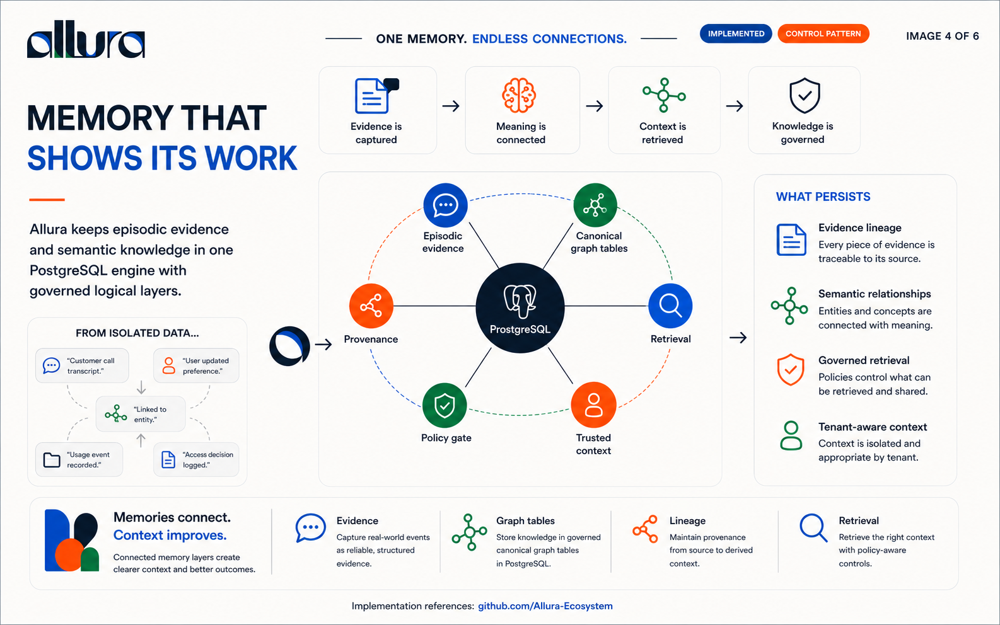
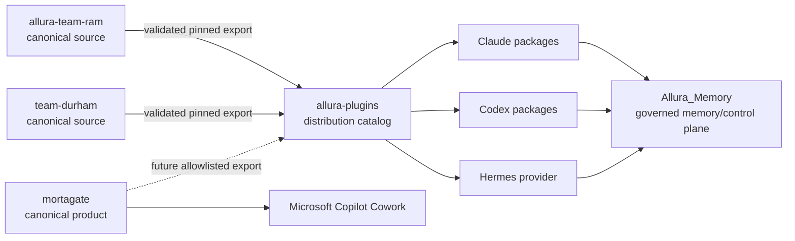
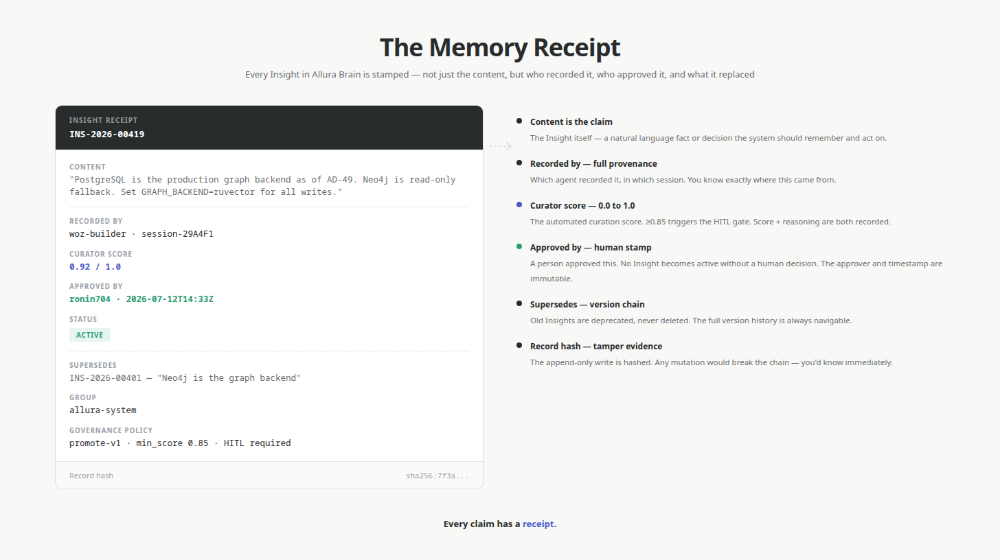
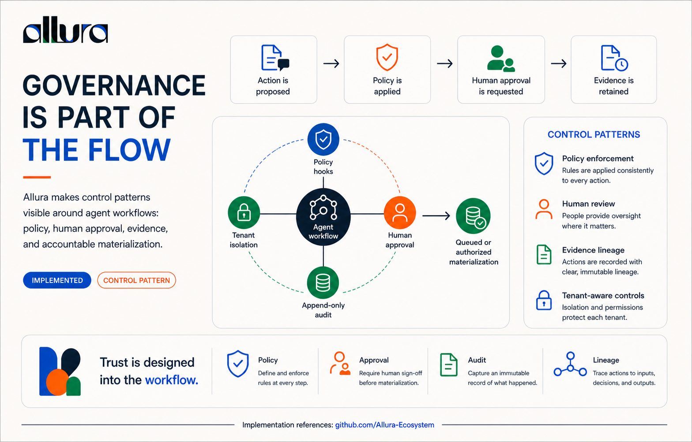

<p align="center">
  
</p>

<h1 align="center">Memory That Shows Its Work</h1>

<p align="center">
  <strong>A governed memory ecosystem for AI agents.</strong><br/>
  Capture activity, govern durable knowledge, and return scoped context with inspectable provenance.
</p>

<p align="center">
  <a href="#what-allura-is">What it is</a> ·
  <a href="#how-it-works">How it works</a> ·
  <a href="#ecosystem-map">Ecosystem</a> ·
  <a href="#governance">Governance</a> ·
  <a href="#quick-start">Quick start</a> ·
  <a href="ECOSYSTEM.md">Full topology</a>
</p>

---

<p align="center">
  <a href="docs/images/framework-and-harness.png"></a><br/>
  <sub><a href="docs/images/framework-and-harness.png">Open the full-size ecosystem overview</a></sub>
</p>

## What Allura is

AI agents generate an enormous amount of activity, but activity is not automatically knowledge. A useful memory system must preserve evidence, separate raw traces from approved truth, enforce tenant boundaries, and explain why a retrieved fact should be trusted.

Allura is the ecosystem built around that problem. Its center is **Allura Memory**, a self-hosted, MCP-native memory and governance service. Around it are workflow plugins and runtime coordination protocols that follow the same evidence-first operating contract:

> **Logs are not knowledge. Knowledge is earned, versioned, scoped, and approved.**

### The three promises

| Promise | What it means in practice |
|---|---|
| **Memory** | Agents can retrieve useful context across sessions without treating every old trace as truth. |
| **Connection** | Claude, Codex, and specialist workflows can coordinate through governed interfaces without being presented as one runtime. |
| **Clarity** | Canonical memory retains tenant scope, lifecycle state, provenance, and version lineage. |

### What Allura is not

- It is not a claim that an AI system can autonomously determine truth.
- It is not a replacement for application authorization, secrets management, or human accountability.
- It does not silently rewrite history; updates create a superseding version and preserve prior evidence.
- It does not treat a successful agent response as proof that the underlying work is correct.

## How it works

<p align="center">
  <a href="docs/images/allura-memory-architecture.png"></a>
</p>

Allura keeps six responsibilities distinct:

1. **Raw traces** — agent events are written to PostgreSQL as append-only evidence.
2. **Curator pipeline** — candidate insights are scored and proposed; the curator does not silently declare truth.
3. **Versioned knowledge** — approved memories live in PostgreSQL graph tables behind the RuVector adapter and use explicit supersession lineage.
4. **Governance decision** — human approval is the accountable boundary; automated curator behavior remains under review.
5. **Retrieval layer** — agents request tenant-scoped context through governed modes; approved-only retrieval is available, while other modes may include episodic evidence.
6. **Policy/API layer** — identity, `group_id`, authorization, audit metadata, and failure behavior are enforced at the boundary.

<p align="center">
  <a href="docs/images/agent-runtime-request-flow.png"></a>
</p>

```text
Agent action
    ↓
Append-only trace
    ↓
Score + proposal
    ↓
Governance review ── reject ──→ episodic evidence remains
    ↓ authorize or queue
Canonical semantic version
    ↓
Scoped retrieval + provenance
```

### One engine, two memory layers

| Layer | Current store | Purpose | Mutation model |
|---|---|---|---|
| Episodic | PostgreSQL 16 + pgvector | Raw events, audit evidence, high-volume traces | Append-only |
| Semantic | PostgreSQL graph tables through the RuVector adapter | Curated memories and relationships | Promote, supersede, deprecate |

Neo4j was sunset as an active dependency under AD-50. Some compatibility code and historical documentation may remain, but new architecture and operator guidance should target the PostgreSQL/RuVector path.

<p align="center">
  <a href="docs/images/persistent-agent-memory.png"></a>
</p>

## The memory receipt

A retrieval result is more useful when its origin is visible. An Allura receipt can include:

- stable memory and trace identifiers;
- actor and runtime identity;
- tenant scope (`group_id`);
- capture time and source;
- confidence and lifecycle status;
- curator decision and witness data;
- version and `SUPERSEDES` lineage;
- degraded-state warnings when a dependency is unavailable.

The receipt does not make a claim true by itself. It makes the claim inspectable.

Implemented receipt shapes vary by operation and interface. Do not assume that every mutation or retrieval returns one unified receipt.

<p align="center">
  <a href="docs/images/an-answer-can-show-its-work.png"></a>
</p>

## Ecosystem map

Allura is organized as independent public repositories with explicit source and distribution boundaries.

| Repository | Responsibility | Authority boundary |
|---|---|---|
| [Allura_Memory](https://github.com/Allura-Ecosystem/Allura_Memory) | Governed memory and control plane: MCP/API, PostgreSQL schema and graph tables, RuVector adapter, curator, policy, audit | Canonical memory implementation |
| [allura-team-ram](https://github.com/Allura-Ecosystem/allura-team-ram) | Standalone Team RAM software-delivery harness for OpenCode, Claude Code, and Codex | Canonical Team RAM source; catalog alias is `team-ram-coding` |
| [team-durham](https://github.com/Allura-Ecosystem/team-durham) | Brand-production system with 12 canonical roles plus the `openagent` compatibility fallback | Canonical Team Durham source; catalog alias is `team-durham` |
| [mortagate](https://github.com/Allura-Ecosystem/mortagate) | Human-supervised mortgage evidence review for Microsoft Copilot Cowork | Canonical Mortgate product source; Salesforce/Veridact files are historical |
| [allura-plugins](https://github.com/Allura-Ecosystem/allura-plugins) | Distribution catalog, runtime manifests, model policy, and release validation | Pinned generated exports are downstream and non-authoritative |
| [.github](https://github.com/Allura-Ecosystem/.github) | Organization profile and community metadata | Maps the public repository surfaces |
| [Allura-ecosystem](https://github.com/Allura-Ecosystem/Allura-ecosystem) | Organization map, shared doctrine, topology, and navigation | This public index; no sibling product code is duplicated here |



The source flow is **standalone repository → validated export → commit-pinned catalog copy**. Fixes go back to the standalone owner before regeneration; generated catalog copies never become a second editable authority. The detailed provenance, verified commit baselines, runtime distinctions, and historical boundaries live in [ECOSYSTEM.md](ECOSYSTEM.md).

## Runtime packages, teams, and products

These surfaces are related but not interchangeable:

| Surface | Runtime and primary job | Authority |
|---|---|---|
| **Allura Cowork** | Claude/Codex coordination with honest runtime attribution and validated handoffs | Catalog-owned `allura-cowork` package |
| **Team Durham** | Portable brand strategy, visual systems, production, accessibility, and QA | Standalone `team-durham`; generated catalog alias `team-durham` |
| **Team RAM** | Portable software delivery: architecture, recon, implementation, review, and validation | Standalone `allura-team-ram`; generated catalog alias `team-ram-coding` |
| **Mortgate Evidence Review** | Microsoft Copilot Cowork skills for human-supervised mortgage evidence review | Standalone `mortagate`; not a Claude/Codex package |

Packages and products do not bypass Allura Memory governance. A manifest, export, model alias, or prepared handoff is not proof that another runtime installed, loaded, or executed it. See the [allura-plugins README](https://github.com/Allura-Ecosystem/allura-plugins) for catalog installation and [ECOSYSTEM.md](ECOSYSTEM.md) for source ownership.

## Governance

<p align="center">
  <a href="docs/images/infographic-memory-receipt.png"></a>
</p>

Six invariant families define the expected boundary behavior:

| Policy | Invariant |
|---|---|
| `pol-001` | Every operation is explicitly tenant-scoped with a valid `group_id`. |
| `pol-002` | Episodic history is append-only; raw trace rows are not rewritten as knowledge. |
| `pol-003` | Canonical changes preserve lineage through supersession rather than in-place mutation. |
| `pol-004` | Human approval is the accountable promotion boundary; automated curator behavior remains under review. |
| `pol-005` | Agent-facing storage access goes through governed MCP/API boundaries. |
| `pol-006` | Tenant namespaces follow the `allura-*` contract and legacy namespaces are treated as drift. |

Governance is fail-visible: callers receive status, warnings, and audit evidence instead of a silent success claim.

<p align="center">
  <a href="docs/images/governance-is-part-of-the-flow.jpg"></a>
</p>

These lowercase governance-registry IDs are distinct from uppercase kernel `POL-*` controls and RuVix `RULE-*` identifiers. Bare references such as “Policy 4” are ambiguous.

### History stays inspectable

Canonical memory is versioned rather than silently rewritten. New knowledge supersedes earlier versions while the supporting evidence and lineage remain available for inspection.

<p align="center">
  <a href="docs/images/memory-keeps-its-history.png"></a>
</p>

## Quick start

### 1. Clone the map and the Brain

```bash
git clone https://github.com/Allura-Ecosystem/Allura-ecosystem.git
git clone https://github.com/Allura-Ecosystem/Allura_Memory.git
```

### 2. Start Allura Memory

```bash
cd Allura_Memory
cp .env.example .env
# Fill the required secrets and database values before starting.
docker compose --env-file .env --env-file .env.local up -d
curl http://localhost:6477/ready
```

The containerized gateway is published on host port `6477`. A directly launched development gateway defaults to `3201`.

### 3. Connect an MCP client

```json
{
  "mcpServers": {
    "allura": {
      "url": "http://localhost:6477/mcp"
    }
  }
}
```

Every memory call must include a valid `group_id`; write operations also carry actor identity for provenance.

### 4. Add the plugin catalog

```text
/plugin marketplace add Allura-Ecosystem/allura-plugins
/plugin install allura-cowork@allura-ecosystem
/plugin install team-durham@allura-ecosystem
/plugin install team-ram-coding@allura-ecosystem
```

From a sibling `allura-plugins` checkout, use `bash allura-plugins/scripts/plugins-update-all.sh --dry-run` before applying cross-runtime plugin updates.

## Documentation map

| Need | Document |
|---|---|
| Full ecosystem inventory | [ECOSYSTEM.md](ECOSYSTEM.md) |
| Brain setup and MCP API | [Allura_Memory README](https://github.com/Allura-Ecosystem/Allura_Memory) |
| Canonical architecture | [Allura Blueprint](https://github.com/Allura-Ecosystem/Allura_Memory/blob/main/docs/allura/BLUEPRINT.md) |
| Decisions and risks | [Risks and Decisions](https://github.com/Allura-Ecosystem/Allura_Memory/blob/main/docs/allura/RISKS-AND-DECISIONS.md) |
| Plugin catalog and validation | [allura-plugins](https://github.com/Allura-Ecosystem/allura-plugins) |
| Organization standards | [Governance docs](docs/governance/) |

## Brand system

The README visuals use the canonical Allura system: **Deep Navy `#1A2B4A`** for trust and structure, **Coral `#E85A3C`** for human decision points, **Trust Green `#4CAF50`** for approved flow, **Clarity Blue `#5B8DB8`** for calm information, and a **Pure White `#F5F5F5`** canvas. The real Allura wordmark is used without reconstruction.

Visuals communicate architecture, provenance, and governance; they do not substitute decoration for evidence.

## License

Allura repositories publish their own license terms. Check the target repository before redistributing code or assets.

<p align="center">
  <em>Memory is the foundation. Intelligence is the outcome.</em>
</p>
