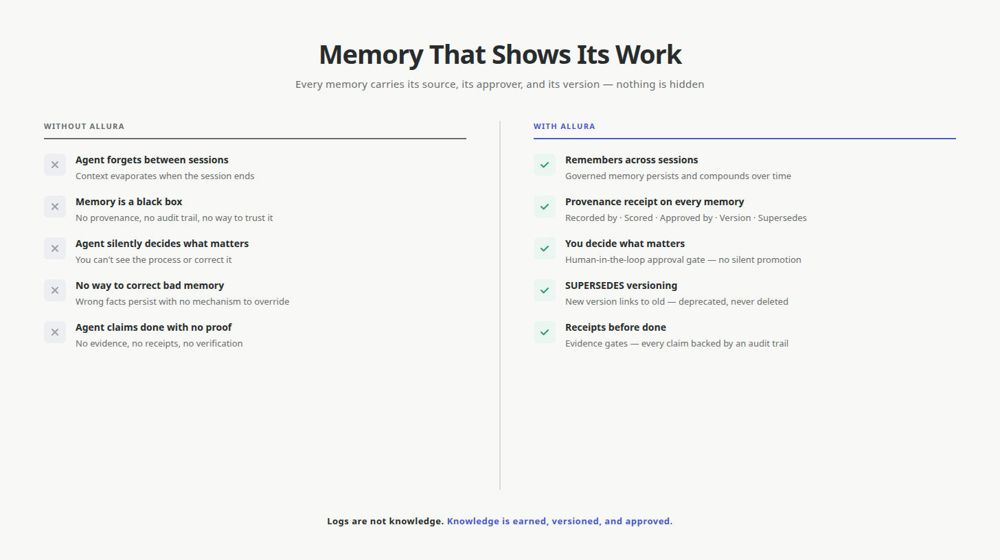
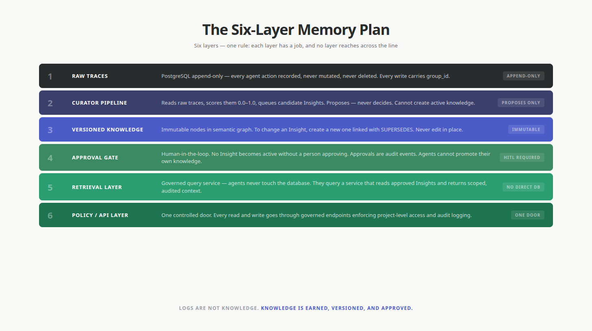
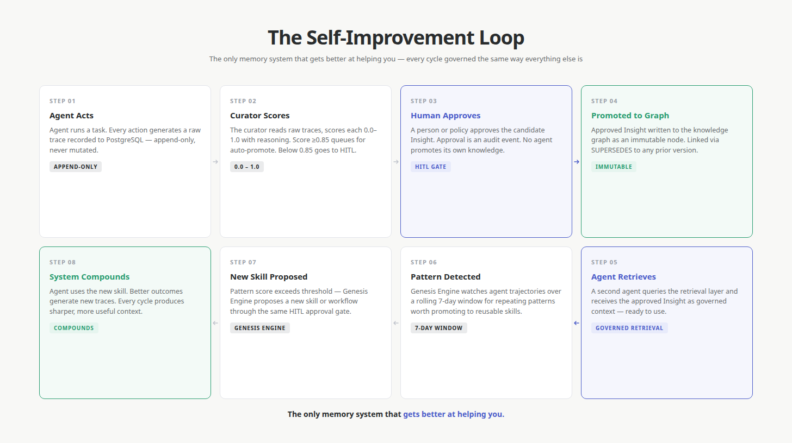

<p align="center">
  
</p>

<h1 align="center">Memory That Shows Its Work</h1>

<p align="center">
  The governed memory engine for AI agents — self-hosted, auditable, self-improving.
</p>

<p align="center">
  <a href="#why-allura">Why Allura</a> &middot;
  <a href="#the-six-layer-memory-plan">The Six Layers</a> &middot;
  <a href="#the-self-improvement-loop">Self-Improvement</a> &middot;
  <a href="#the-memory-receipt">The Receipt</a> &middot;
  <a href="#the-ecosystem">Ecosystem</a> &middot;
  <a href="#quick-start">Quick Start</a> &middot;
  <a href="#governance">Governance</a>
</p>

---

<p align="center">
  
</p>

## Why Allura?

AI agents forget. Sessions end, context evaporates, and the hard-won knowledge your team built disappears into the void. Worse — when agents *do* "remember," you can't trust it. Did the agent actually retrieve a real decision, or did it hallucinate one? Where did the answer come from? Who approved it? Is it current or stale?

Current AI memory is a black box. mem0, ChatGPT memory, Cursor context — they all silently decide what matters. You can't see the process. You can't audit it. You can't govern it. You can't correct it when it's wrong.

Allura is memory that shows its work.

Every memory starts as a **trace** — a raw recording of what an agent did. Then it moves through a governed pipeline: scoring, review, promotion. Nothing becomes "knowledge" without a person approving it. Every memory carries its provenance — who recorded it, when, from what source, who approved it, what version it is, what it supersedes.

This is memory you can trust because you can see how it was made.

| Without Allura | With Allura |
|---|---|
| Agent forgets between sessions | Agent remembers across sessions |
| "Where did this answer come from?" → black box | "Where did this answer come from?" → provenance receipt |
| Agent silently decides what matters | You decide what matters — human-in-the-loop approval |
| Memory is a black box | Memory shows its work — every promotion auditable |
| No way to correct bad memory | SUPERSEDES — new version links to old, old is deprecated, never deleted |
| Agent claims "done" with no proof | Receipts before "done" — evidence gates |
| One tenant's data can leak to another | `group_id` isolation — enforced at the database level |

---

<p align="center">
  
</p>

## The Six-Layer Memory Plan

The core principle: **logs are not knowledge.** Raw agent activity is cheap and noisy. Knowledge is expensive, versioned, and approved. Allura keeps these two things in separate layers and never lets them collapse into each other.

Six layers, one rule: each layer has a job, and no layer reaches across the line.

1. **Raw Traces** — PostgreSQL, append-only. Every agent action is recorded, never mutated, never deleted. Every write carries a `group_id` so tenancy is enforced at the row level.
2. **Curator Pipeline** — proposes, never decides. A service reads raw traces, finds patterns, scores them, and queues candidate Insights. It cannot create active knowledge.
3. **Versioned Knowledge** — immutable nodes. Approved Insights live in a semantic graph (RuVector on PostgreSQL; Neo4j 5.26 as read-only fallback per AD-49). To change an Insight, create a new one and link it with SUPERSEDES. Never edit in place.
4. **Approval Gate** — human-in-the-loop. No Insight becomes active without a person or policy approving it. Approvals are audit events. Agents cannot promote their own knowledge.
5. **Retrieval Layer** — governed query service. Agents never touch the database. They query a service that reads approved Insights and returns scoped, audited context.
6. **Policy / API Layer** — one controlled door. Every read and write goes through governed endpoints that enforce project-level access, agent permissions, and audit logging.

The rule: logs are not knowledge. Each layer has a job. The layers never collapse.

---

<p align="center">
  
</p>

## The Self-Improvement Loop

This is the thing no competitor has. The system gets better at helping agents by learning from what they do — and the learning is governed the same way everything else is.

1. **Agent acts** → raw trace recorded (PostgreSQL, append-only)
2. **Curator scores** the trace (0.0–1.0 with reasoning)
3. **Score ≥ 0.85** → auto-promote candidate · **Score < 0.85** → human-in-the-loop approval queue
4. **Promoted to knowledge graph** — immutable, versioned via SUPERSEDES
5. **Genesis Engine watches** agent trajectories over a rolling 7-day window
6. **Pattern detected** → propose a new skill or workflow
7. **Agent uses the new skill** → better outcomes → new traces
8. **The system compounds** — every cycle produces sharper, more useful context

The loop is what makes Allura a steward rather than a vault. It remembers, but it also learns how to remember better — and every step of that learning is itself audited, versioned, and reversible.

### Why this matters in July 2026

Mem0, Zep, Letta, Cognee, and Supermemory all store agent memory. None of them govern it. There is no human-in-the-loop gate, no append-only audit trail, no SUPERSEDES versioning, no Genesis Engine watching for patterns worth promoting to reusable skill. They are black boxes that silently decide what matters.

Allura is the only system that combines **governance** (provenance, approval, versioning) with **self-improvement** (the curator + Genesis loop). Memory you can trust, and a system that gets better at earning that trust.

---

<p align="center">
  
</p>

## The Memory Receipt

Every memory in Allura comes with a receipt. This is the reason you can trust it.

```
RECEIPT — memory_id: mem_8f3a2c1b
──────────────────────────────────────────────
Recorded by:   agent::brooks-orchestrator
Recorded at:   2026-07-22T14:31:08Z
Source:        conversation
Group:         allura-team-ram
Score:         0.87  (adoption tier — auto-promoted)
Approved by:   curator::durham-01
Approved at:   2026-07-22T15:02:44Z
Version:       2
Supersedes:    mem_8f3a2c1b  v1   (reason: refined scope)
──────────────────────────────────────────────
```

When an agent retrieves this memory, it sees the same receipt you see. When a regulator asks "why did the agent do that?", you can walk the chain from action → trace → proposal → approval → knowledge → retrieval. Nothing is hidden. Nothing is lost. Nothing is edited in place.

This is what "memory that shows its work" means in practice.

---

## The Ecosystem

Allura is one Brain surrounded by a growing ecosystem of runtimes, harnesses, and products. Every one of them rides on the same governed memory and the same audit guarantees.

| Repo | Role | Visibility |
|------|------|:----------:|
| [Allura_Memory](https://github.com/Allura-Ecosystem/Allura_Memory) | The brain — core memory engine | Public |
| [Allura-ecosystem](https://github.com/Allura-Ecosystem/Allura-ecosystem) | Ecosystem map — this source-of-truth index | Public |
| [allura-team-ram](https://github.com/Allura-Ecosystem/allura-team-ram) | Engineering harness — 10 specialists, self-evolving, HITL | Public |
| [allura-plugins](https://github.com/Allura-Ecosystem/allura-plugins) | Plugin catalog + model governance registry (`models.yaml`) | Private |
| [allura-team-durham](https://github.com/Allura-Ecosystem/allura-team-durham) | Brand harness — design, copy, strategy | Private |
| [agent-backups](https://github.com/Allura-Ecosystem/agent-backups) | Agent config backups (Hermes, OpenClaw, NanoClaw, OneCLI) | Private |
| [open-design](https://github.com/Allura-Ecosystem/open-design) | Local-first open-source Claude Design alternative | Public |
| [mortagate](https://github.com/Allura-Ecosystem/mortagate) | Veridact — mortgage audit replay & QC platform on Salesforce | Public |
| [.github](https://github.com/Allura-Ecosystem/.github) | Org profile & community health files | Public |
| [allura](https://github.com/Allura-Ecosystem/allura) | Reserved namespace (points to Allura_Memory) | Public |

The pattern is always the same: a runtime generates activity, the Brain records it as immutable traces, the curator proposes insights, a person approves, and approved knowledge flows back to every runtime through one controlled retrieval layer. Different plugins serve different use cases; the governance underneath never changes.

See [ECOSYSTEM.md](./ECOSYSTEM.md) for the full topology.

---

## Quick Start

```bash
# Clone the ecosystem map (this repo)
git clone https://github.com/Allura-Ecosystem/Allura-ecosystem.git

# Clone the brain
git clone https://github.com/Allura-Ecosystem/Allura_Memory.git

# Clone a harness
git clone https://github.com/Allura-Ecosystem/allura-team-ram.git
git clone https://github.com/Allura-Ecosystem/allura-team-durham.git

# Clone the plugin catalog + model registry
git clone https://github.com/Allura-Ecosystem/allura-plugins.git
```

The brain is a Next.js app backed by PostgreSQL + pgvector, with a RuVector graph adapter on PostgreSQL for semantic memory and Neo4j 5.26 as a read-only fallback. See [`Allura_Memory/README.md`](https://github.com/Allura-Ecosystem/Allura_Memory) for local setup, environment variables, and MCP wiring.

---

## Plugin Marketplace

The [`allura-plugins`](https://github.com/Allura-Ecosystem/allura-plugins) repo hosts the `allura-ecosystem` Claude marketplace with four validated plugins:

- **allura-cowork** — Claude + Codex cowork protocol
- **team-durham** — brand production team (design, copy, strategy)
- **team-ram-coding** — Brooks, Jobs, Scout, Woz workflows
- **team-ram-harness** — full self-evolving 10-agent harness (v0.4.2)

Install across all four runtimes (Claude, Codex, Hermes, OpenClaw) with one command:

```bash
./scripts/plugins-update-all.sh
```

---

## Model Governance

The [`docs/models.yaml`](https://github.com/Allura-Ecosystem/allura-plugins/blob/main/docs/models.yaml) registry in `allura-plugins` is the **single source of truth** for agent-to-model mapping across all runtimes. It covers **47 agents across 7 models**, with per-runtime aliases, fallback chains, and CLASSIC eval fixtures.

Research-informed design:

- Static registry ([arxiv 2508.03095](https://arxiv.org/abs/2508.03095)) for stable, reproducible routing
- Centralized management (Solace Agent Mesh) so policy lives in one place
- Per-agent override (OpenClaw) for local flexibility without breaking the registry
- Fallback chains (RouteLLM) so a down model never stops the work
- CLASSIC eval framework (Aisera) and three-level assessment (AWS/Amazon)
- Canary before promotion — no model goes live without proving itself

---

## Governance

Allura is governed by **six invariant policies** (POL-001 through POL-006) enforced by the RuVector governance gate. Every memory write, promotion, and retrieval is audited. No agent bypasses the gate.

| Policy | What it enforces |
|--------|------------------|
| POL-001 | `group_id` on every read/write — missing is a hard failure |
| POL-002 | Append-only traces — no UPDATE/DELETE on PostgreSQL trace rows, ever |
| POL-003 | SUPERSEDES versioning — never mutate a historical knowledge node |
| POL-004 | HITL approval — no agent promotes its own knowledge |
| POL-005 | MCP-only database access — never `docker exec` |
| POL-006 | `allura-*` namespace only — any `roninclaw-*` is flagged as drift |

The six layers, the receipt, and the self-improvement loop are all downstream of these policies. If a gate fails, the operation does not happen. If a policy is violated, it shows up in the audit log. Nothing is silent.

See [ECOSYSTEM.md](./ECOSYSTEM.md#7-governance) for the full policy text and the audit log format.

---

## License

Allura is open source. See individual repos for specific license terms.

<p align="center">
  <em>Logs are not knowledge. Knowledge is earned, versioned, and approved.</em>
</p>