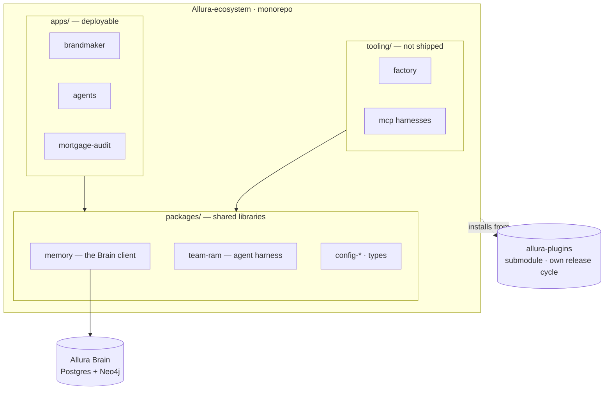
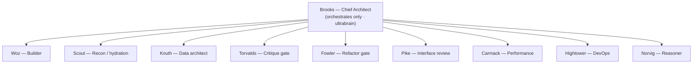
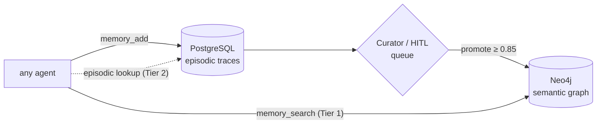

# Allura Ecosystem — Architecture

> The map of the system. Diagrams are Mermaid so GitHub renders them and they stay
> version-controlled (no stale screenshots). Detail lives in linked docs; this stays lean.
> Source of truth for planning is Notion — this mirrors it.

Allura is the command center — memory, planning, governance, and operations — across Sabir's
projects (Faith Meats, Difference Driven, client work). Everything lives in one monorepo on
`github.com/Allura-Ecosystem/team_durham`.

---

## 1. Ecosystem map



`apps/` ships, `packages/` is shared code, `tooling/` builds. `allura-plugins` stays a
**submodule** (independent release cycle + cross-runtime catalog). The **Brain** is the shared
memory every agent reads and writes.

---

## 2. Team RAM — the surgical team

One architect (Brooks) holds conceptual integrity; specialists keep their craft. Model tier per
agent is set in `tooling/agent-sync/models.map.json`.



| Tier | Codex (`.opencode`) | Claude (`.claude`) | Agents |
| --- | --- | --- | --- |
| ultrabrain | `openai/gpt-5.5` | `opus` | Brooks, Norvig |
| standard | `ollama-cloud/minimax-m3` | `sonnet` | Woz, Torvalds, Knuth, Fowler, Pike, Carmack, Bellard, Hightower |
| cheap | `ollama-cloud/minimax-m3` | `haiku` | Scout |

---

## 3. The Brain — memory data-flow

Dual-layer: PostgreSQL holds raw episodic traces; promoted insights graduate to the Neo4j
semantic graph through a human-in-the-loop curator. Append-only; `group_id = allura-system`.



---

## 4. Agent sync — one persona, two runtimes

The body lives once in `.opencode`; `.claude` mirrors are generated. The **only** per-runtime
difference is the model. Hand-editing a mirror is forbidden — CI fails on drift.

```mermaid
flowchart LR
  SRC["`.opencode/agent/core/*.md`<br/>SOURCE OF TRUTH"] --> GEN["sync-agents.mjs"]
  MAP["`models.map.json`<br/>per-runtime model by tier"] --> GEN
  GEN --> MIRROR["`.claude/agents/*.md`<br/>generated mirror (do not edit)"]
  GEN -->|"--check"| CI{"CI drift gate<br/>exit 1 on drift"}
```

---

## Related docs

- Consolidation plan & goal: [`ALLURA-CONSOLIDATION-PLAN.md`](./ALLURA-CONSOLIDATION-PLAN.md), [`ALLURA-CONSOLIDATION-GOAL.md`](./ALLURA-CONSOLIDATION-GOAL.md)
- Target layout: [`ALLURA-LAYOUT.md`](./ALLURA-LAYOUT.md)
- Agent sync tooling: `Agent-Harnesses/Allura-TeamRam/tooling/agent-sync/README.md`
- Plugin catalog: `allura-plugins/docs/`
- Journal entries: [`journal/`](./journal/)

---

## Current state vs. plan (drift log)

> Updated 2026-06-14. The target `apps/packages/tooling` layout is **not yet built**.
> The repo is still in transition. Real on-disk state:

| Path | Status | Notes |
| --- | --- | --- |
| `web/payload/auntie-ny/` | **Present, uncommitted** | 93 MB, fresh clone from `Charitablebusinessronin/auntienyastro-recovered` (orphan gitdir was lost; recovered from upstream). 4 branches: master, astro-source-reconstruction, rebuild-2026-05-25, work2. |
| `web/payload/dd-site-payload/` | **Present, uncommitted** | 6.6 GB, pre-moved from `Projects/web/`. Own `.git/` retained. |
| `Client-Projects/mortgage-audit/` | **Present, dirty** | Salesforce/SFDX (2.1 GB). Uncommitted changes (README, demo dir, OnboardingController.cls). |
| `allura-memory/`, `Agent-Harnesses/Allura-TeamRam/`, `allura-plugins/` | **Submodules** | Decision pending: keep as submodules or convert to folders per Phase 3. |
| `allura-memory-haunted` (under `Projects/Archives/`) | **Archive** | 2.5 GB ghosted copy of a prior state; do not develop here. |

**Open before any commit:**
1. Phase 2 — `.gitignore` repair + LFS migration (the 6.6 GB `dd-site-payload/` includes `node_modules`, `.pnpm-store`, `.next`, `evidence/`, `dogfood-output/`, `playwright-report/`, `test-results/`, `_bmad-output/` — all should be excluded or LFS'd).
2. ~~Decision: `web/payload/` (current convention) vs. `Client-Projects/payload/` (originally requested). Reconcile.~~ **Resolved 2026-06-14**: `web/payload/` stays. Gitignored sibling, matches sibling-project pattern.
3. ~~Cleanup: orphaned Codex worktrees at `/media/ronin704/Games/linux-home/.codex/worktrees/{9b72,4376}/auntie ny/` are now redundant with the upstream clone (2.5 GB + 77 MB reclaimable).~~ **Resolved 2026-06-14**: both worktrees deleted, 2.6 GB reclaimed. Upstream clone at `web/payload/auntie-ny/` is the sole source of truth.
4. ~~Stale partial copy at `/media/ronin704/Games/Projects/auntie ny/` (1.5 GB, 74k files, no git) from an aborted `cp -a`.~~ **Resolved 2026-06-14**: deleted. Upstream clone is the source of truth.
5. ~~Commit gate: stage .opencode/agents/ edits + doc renames.~~ **Resolved 2026-06-14**: committed as `dd9732e` (git mv preserves rename history). Pushed to `github.com/Allura-Ecosystem/Alluradesign-teamdurham`. Remote URL corrected from stale `Allura-ecosystem.git` → `Alluradesign-teamdurham.git`.
6. ~~`.gitignore` fix: root-relative paths for sibling dirs.~~ **Resolved 2026-06-14**: `/docs/`, `/web/`, `/design/`, `/tools/`, `/veridact-frontend/` now root-relative. `Allura-ecosystem/docs/` is correctly tracked.
7. 6 ADRs logged to episodic (PostgreSQL) this session, pending curator promotion to semantic (Neo4j). `allura-brain_memory_promote` tool unavailable in current session — will graduate when curator queue processes them.

**Mermaid diagram in §1 shows the target, not the current state.**
